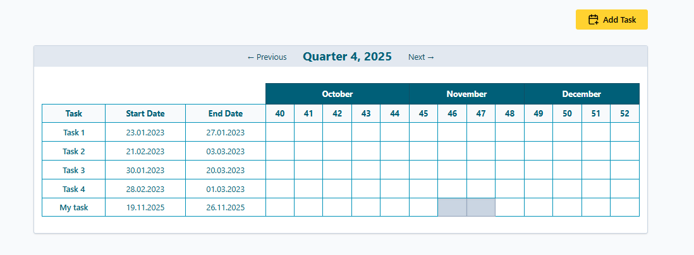

# Task Scheduler - Quarterly View

A React-based task scheduling application that displays tasks in a quarterly calendar view with week-based timeline visualization.



## Features
- **Quarterly Calendar View**: Navigate through quarters to view tasks across a 3-month period
- **Week-based Timeline**: Tasks are displayed across ISO week numbers, with intelligent week-to-month assignment
- **Smart Week Assignment**: Weeks are assigned to the month containing the majority of days in that week
- **Task Management**: Add tasks with date range selection
- **Visual Task Tracking**: Task bars span across relevant weeks
- **Responsive Design**: Clean, modern UI with a harmonious color palette

## Technical Stack

- **React 19** with TypeScript
- **Vite** for fast development and building
- **Zustand** for state management
- **date-fns** for date calculations and ISO week handling
- **react-hook-form + Zod** for form validation
- **react-day-picker** for date range selection
- **Tailwind CSS** for styling
- **Lucide React** for icons

## Getting Started

### Prerequisites

- Node.js (v18 or higher recommended)
- npm or yarn

### Installation

1. Clone the repository:
```bash
git clone https://github.com/magicflute21/taskscheduler.git
cd taskscheduler
```

2. Install dependencies:
```bash
npm install
```

3. Start the development server:
```bash
npm run dev
```

4. Open your browser and navigate to `http://localhost:5173`

### Build for Production
```bash
npm run build
```

## Implementation Highlights

### Week Assignment Logic

The application implements a custom algorithm to assign ISO weeks to months based on the requirement: **a week belongs to the month that contains the majority of its days**. This is particularly important for weeks that span month boundaries.

## Design Decisions

- **date-fns over custom date logic**: Leveraged battle-tested library for reliable date arithmetic while implementing custom business logic for week-to-month assignment
- **Semantic HTML tables**: Used proper `<table>` elements for tabular data with accessible markup
- **Form validation**: Integrated react-hook-form with Zod for type-safe, declarative validation
- **Minimal dependencies**: Focused on essential libraries while keeping the bundle size reasonable

## Personal Notes

This project was built as a take-home assignment to demonstrate:
- Clean React architecture and modern hooks usage
- TypeScript proficiency with proper typing
- Algorithmic thinking (week assignment logic)
- UI/UX sensibility with attention to visual design
- Professional development practices (validation, error handling, code organization)

## Author

Triin - [GitHub](https://github.com/magicflute21)